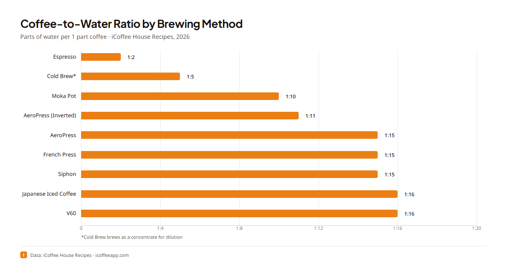
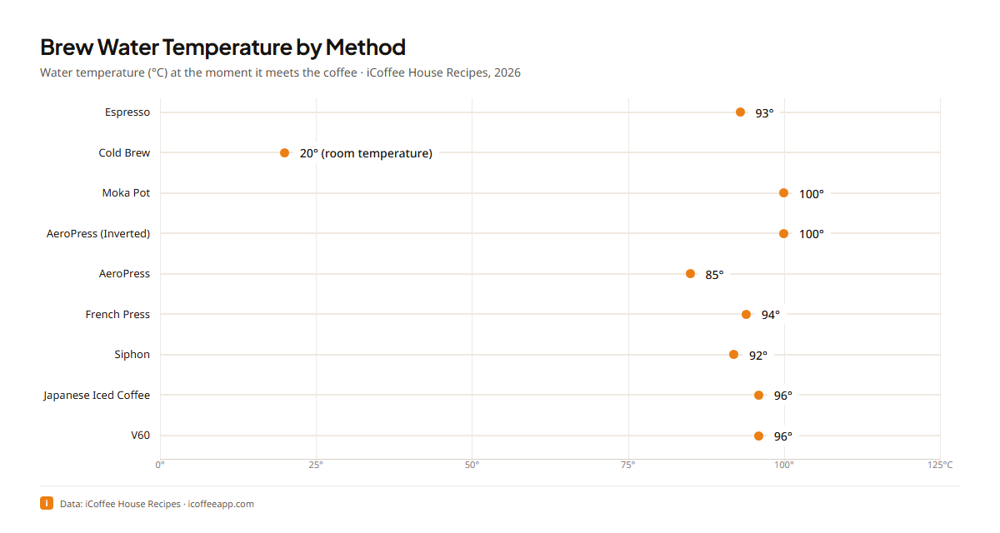

# Coffee Brewing Data

Brewing parameters and data graphics from the published
[iCoffee](https://icoffeeapp.com) house recipes: coffee-to-water ratio, water
temperature, dose, and brew water for every brewing method we publish, as
machine-readable data files and charts in five languages. The methods covered
today: espresso, moka pot, V60, AeroPress (standard and inverted), French
press, siphon, cold brew, and Japanese iced coffee.

All values are the parameters we actually publish and maintain in our recipes,
not aggregated third-party figures. The full write-up with context and sources
lives on the iCoffee coffee statistics page:
**[icoffeeapp.com/en/learn/coffee-statistics](https://icoffeeapp.com/en/learn/coffee-statistics)**.

## Data files

| File | Contents |
|---|---|
| [`data/brewing-parameters.csv`](data/brewing-parameters.csv) | One row per house recipe: `canonical_id`, `method_en`, `ratio`, `water_parts`, `water_temp_c`, `coffee_dose_g`, `brew_water_ml` |
| [`data/brewing-parameters.json`](data/brewing-parameters.json) | Same dataset with export metadata (`generated_at`, `source_hash`, `recipe_count`) |
| [`data/method-labels.csv`](data/method-labels.csv) / [`.json`](data/method-labels.json) | Localized brewing-method display names (English, Spanish, Brazilian Portuguese, Simplified and Traditional Chinese) |

`ratio` is the coffee-to-water ratio as published (e.g. `1:15`); `water_parts`
is its numeric water side for sorting and plotting. `water_temp_c` is the brew
water temperature in °C. Missing values (e.g. no meaningful dose for a method)
are empty in CSV and `null` in JSON.

## Brewing parameters at a glance

The full dataset, from the current published recipes:

| Method | Ratio | Water temp (°C) | Coffee dose (g) | Brew water (ml) |
|---|---|---|---|---|
| Espresso | 1:2 | 93 | 18 | 36 |
| Cold Brew | 1:5 | 20 | 200 | 1000 |
| Moka Pot | 1:10 | 100 | 18 | 160 |
| AeroPress (Inverted) | 1:11 | 100 | 18 | 200 |
| AeroPress | 1:15 | 85 | 15 | 225 |
| French Press | 1:15 | 94 | 30 | 450 |
| Siphon | 1:15 | 92 | 17 | 255 |
| Japanese Iced Coffee | 1:16 | 96 | 30 | 300 |
| V60 | 1:16 | 96 | 18 | 288 |

The CSV/JSON files carry the same rows with stable recipe ids and the
localized method names.

## Charts

Rendered from this dataset by the iCoffee data-graphics pipeline. Each chart
exists in all five languages (`-en`, `-es`, `-pt-BR`, `-zh-CN`, `-zh-TW`).

### Coffee-to-water ratio by brewing method



### Brew water temperature by brewing method



Localized versions of the ratio chart:
[es](charts/brew-ratio-by-method-es.png) ·
[pt-BR](charts/brew-ratio-by-method-pt-BR.png) ·
[zh-CN](charts/brew-ratio-by-method-zh-CN.png) ·
[zh-TW](charts/brew-ratio-by-method-zh-TW.png).
Localized versions of the temperature chart:
[es](charts/brew-temp-by-method-es.png) ·
[pt-BR](charts/brew-temp-by-method-pt-BR.png) ·
[zh-CN](charts/brew-temp-by-method-zh-CN.png) ·
[zh-TW](charts/brew-temp-by-method-zh-TW.png).

The `charts/coffee-statistics-cover-*.png` images are the article covers for the
statistics page in each language.

## Using the charts and data

You are welcome to embed the charts and cite the data, including in commercial
editorial work (articles, reviews, videos), with credit to iCoffee and a link
where the medium allows it. Ready-made embed with attribution:

**Markdown**

```markdown

Source: [iCoffee coffee statistics](https://icoffeeapp.com/en/learn/coffee-statistics)
```

**HTML**

```html
<figure>
  
  <figcaption>Source:
    <a href="https://icoffeeapp.com/en/learn/coffee-statistics">iCoffee coffee statistics</a>
  </figcaption>
</figure>
```

See [`LICENSE.md`](LICENSE.md) for the exact terms. The statistics page is also
available in
[Spanish](https://icoffeeapp.com/es/aprende/estadisticas-del-cafe),
[Brazilian Portuguese](https://icoffeeapp.com/pt-BR/aprenda/estatisticas-do-cafe),
[Simplified Chinese](https://icoffeeapp.com/zh-CN/xuexi/kafei-tongji-shuju), and
[Traditional Chinese](https://icoffeeapp.com/zh-TW/xuexi/kafei-tongji-shuju).

## Provenance and freshness

The dataset is exported from the same recipe corpus that renders the charts on
the live site; [`SOURCE.md`](SOURCE.md) records the corpus hash and export date
for the current revision. This repository is refreshed whenever the published
recipe data changes (new recipes, adjusted parameters, or new chart types), so
the files here always match what the site shows.

## About iCoffee

[iCoffee](https://icoffeeapp.com) is a free coffee app for iPhone and Android:
scan your beans, get personalized AI guidance, track every brew. Its published
house recipes are the source of the data in this repository.
